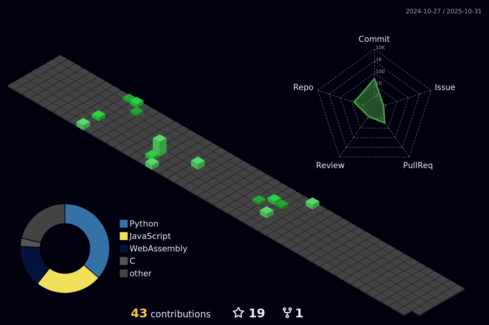

I'm a reverse engineer from Sweden with 4-5 years of experience. I enjoy figuring out how things work and breaking down complex systems.

- Skilled in **Python**, **JavaScript**, **WASM**, and some **Go**. (Doing some stuff with **Rustlang**)

```bash
pip install dexvstuff
```
## Contact

Interested in working together? Reach out on [Telegram](https://t.me/dexv0) and or visit my website at [dexv.lol](https://dexv.lol).

Join my telegram channel [Dexv’s channel](https://t.me/dexvleads) for regular updates on what I am working on.


